    

Hello friends! I’m a beginner software developer currently learning everything I can :D I’m always working on a few projects at a time and always trying to learn something new and improve my skills. I take a very positive approach to software development and believe every creation has value. Get out there and make something! 💖

  

<h2>Highlights</h2>

Projects in Development

 Here are some of the projects I'm currently working on:
 
 <ul><li><a href=https://github.com/ClaireWhere/gsabot target="_blank" rel="noopener noreferrer">ClaireWhere/gsabot</a> (📄 Language: <b>JavaScript</b> | 🗃️ Issues: <b>12</b> | 📅 Last updated: <b>2024-05-04T15:19:41Z</b>): Discord bot for the Gender and Sexuality Alliance.</li><ul><li>🏷️ Current Release: <a href=https://github.com/ClaireWhere/gsabot/releases/tag/0.1.4 target="_blank" rel="noopener noreferrer">v0.1.4</a> (Published: <b>2023-10-18T00:17:55Z</b>)</li></ul><li><a href=https://github.com/ClaireWhere/GameJam14 target="_blank" rel="noopener noreferrer">ClaireWhere/GameJam14</a> (📄 Language: <b>C#</b> | 🗃️ Issues: <b>27</b> | 📅 Last updated: <b>2024-04-09T00:19:48Z</b>): This is a game that started as a project for a game jam. The game jam is long over, and due to school and work it never got finished. We're now working on it in our free time, and we're hoping to get it to a (somewhat) playable state someday!</li>
</ul>

Released Projects

 Here are some of the completed projects I've released:
 
 <ul><li><a href=https://github.com/ClaireWhere/BungaBotDiscord target="_blank" rel="noopener noreferrer">ClaireWhere/BungaBotDiscord</a> (📄 Language: <b>JavaScript</b> | 🗃️ Issues: <b>0</b> | 📅 Last updated: <b>2024-01-06T15:25:48Z</b>): null</li><ul><li>🏷️ Current Release (pre-release): <a href=https://github.com/ClaireWhere/BungaBotDiscord/releases/tag/0.1.0 target="_blank" rel="noopener noreferrer">v0.1.0</a> (Published: <b>2024-01-03T03:40:04Z</b>)</li></ul><li><a href=https://github.com/ClaireWhere/BungaBotTwitch target="_blank" rel="noopener noreferrer">ClaireWhere/BungaBotTwitch</a> (📄 Language: <b>JavaScript</b> | 🗃️ Issues: <b>0</b> | 📅 Last updated: <b>2024-01-05T18:43:47Z</b>): Simple Twitch chat bot for AAAAurora_'s stream</li><ul><li>🏷️ Current Release: <a href=https://github.com/ClaireWhere/BungaBotTwitch/releases/tag/v0.1.1 target="_blank" rel="noopener noreferrer">0.1.1</a> (Published: <b>2023-08-02T02:14:29Z</b>)</li></ul><li><a href=https://github.com/ClaireWhere/NewTab target="_blank" rel="noopener noreferrer">ClaireWhere/NewTab</a> (📄 Language: <b>JavaScript</b> | 🗃️ Issues: <b>0</b> | 📅 Last updated: <b>2023-12-28T16:53:11Z</b>): null</li>
</ul>

Extra Info

<ul>
<li>⭐️ Pronouns: She/Her</li>
<li>💬 How to reach me: DM me <a href="https://discord.com/users/clairewhere">@ClaireWhere</a> on Discord</li>
<li>🌱 I’m currently (always) learning: C#, Java, JavaScript, Python, TypeScript, and more!</li>
</ul>

<a href="https://github.com/ClaireWhere" target="_blank" rel="noopener noreferrer">💖</a>

