    

Hello friends! I love to work on fun little projects to learn more about software development and improve my skills. I love learning and exercising my creativity and take a very positive approach to life. I believe everything has value! Fun fact: I <em>enjoy</em> making diagrams and writing documentation - call me crazy if you want. Oh also I love bread 🍞💖

  

<h2>Highlights</h2>

Projects in Development

 These are some projects I'm currently working on. Some of them may never be completed, but I like to keep them because they're good memories.
 
 <ul><li><a href=https://github.com/ClaireWhere/gsabot target="_blank" rel="noopener noreferrer">ClaireWhere/gsabot</a> (📄 Language: <b>JavaScript</b> | 🗃️ Issues: <b>16</b> | 📅 Last updated: <b>2024-10-07T03:02:38Z</b>): Discord bot for the Gender and Sexuality Alliance.</li><ul><li>🏷️ Current Release: <a href=https://github.com/ClaireWhere/gsabot/releases/tag/0.1.4 target="_blank" rel="noopener noreferrer">v0.1.4</a> (Published: <b>2023-10-18T00:17:55Z</b>)</li></ul><li><a href=https://github.com/ClaireWhere/GameJam14 target="_blank" rel="noopener noreferrer">ClaireWhere/GameJam14</a> (📄 Language: <b>C#</b> | 🗃️ Issues: <b>27</b> | 📅 Last updated: <b>2024-04-09T00:19:48Z</b>): This is a game that started as a project for a game jam. The game jam is long over, and due to school and work it never got finished. We're now working on it in our free time, and we're hoping to get it to a (somewhat) playable state someday!</li>
</ul>

Released Projects

 These are some projects I've "completed" (whatever that means). Basically, these ones have the potential to work!
 
 <ul><li><a href=https://github.com/ClaireWhere/BungaBotDiscord target="_blank" rel="noopener noreferrer">ClaireWhere/BungaBotDiscord</a> (📄 Language: <b>JavaScript</b> | 🗃️ Issues: <b>0</b> | 📅 Last updated: <b>2024-06-22T02:45:09Z</b>): null</li><ul><li>🏷️ Current Release (pre-release): <a href=https://github.com/ClaireWhere/BungaBotDiscord/releases/tag/0.1.0 target="_blank" rel="noopener noreferrer">v0.1.0</a> (Published: <b>2024-01-03T03:40:04Z</b>)</li></ul><li><a href=https://github.com/ClaireWhere/BungaBotTwitch target="_blank" rel="noopener noreferrer">ClaireWhere/BungaBotTwitch</a> (📄 Language: <b>JavaScript</b> | 🗃️ Issues: <b>0</b> | 📅 Last updated: <b>2024-06-27T00:23:03Z</b>): Simple Twitch chat bot for AAAAurora_'s stream</li><ul><li>🏷️ Current Release: <a href=https://github.com/ClaireWhere/BungaBotTwitch/releases/tag/v0.1.1 target="_blank" rel="noopener noreferrer">0.1.1</a> (Published: <b>2023-08-02T02:14:29Z</b>)</li></ul><li><a href=https://github.com/ClaireWhere/NewTab target="_blank" rel="noopener noreferrer">ClaireWhere/NewTab</a> (📄 Language: <b>JavaScript</b> | 🗃️ Issues: <b>0</b> | 📅 Last updated: <b>2023-12-28T16:53:11Z</b>): null</li>
</ul>

Extra Info

<ul>
<li>⭐️ Pronouns: She/Her</li>
<li>💬 DM me <a href="https://discord.com/users/clairewhere">@ClaireWhere</a> on Discord if you wanna talk to me</li>
<li>🌱 The first programming language I used extensively was TI-BASIC which I learned to make goofy little games and programs on my calculators. By now I’ve moved on to more modern languages :p</li>
</ul>

<a href="https://github.com/ClaireWhere" target="_blank" rel="noopener noreferrer">💖</a>

